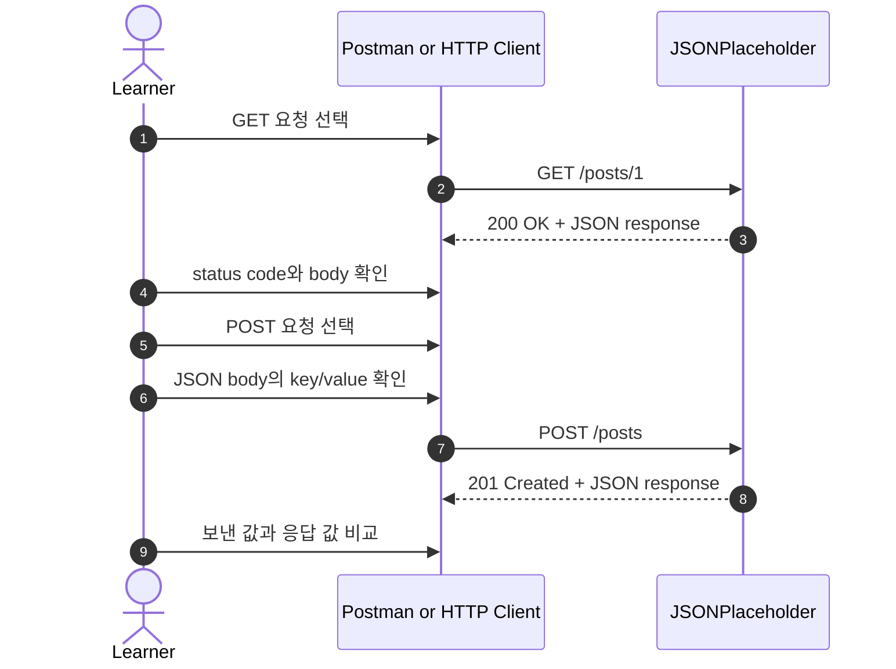
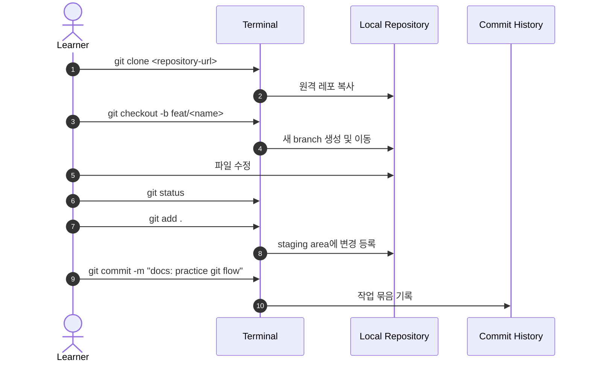
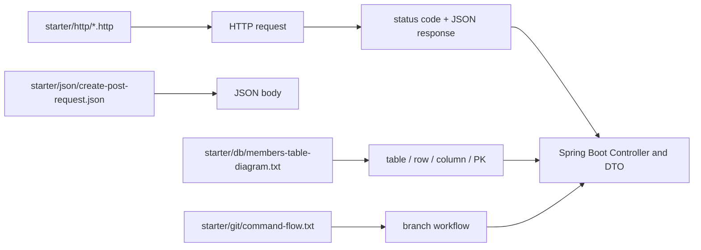

# 이론 정리

> 이번 시퀀스는 서버 코드를 구현하지 않습니다. HTTP 요청/응답, JSON, Git branch, DB 기본 용어를 먼저 맞춰 다음 Spring Boot 실습에서 Controller, DTO, Repository 흐름을 읽을 준비를 하는 단계입니다.

## 1. Problem - 왜 선수지식이 필요한가

다음 시퀀스부터는 `./gradlew bootRun`으로 서버를 실행하고, HTTP 요청을 보내고, JSON 응답을 읽고, 브랜치별로 실습을 진행합니다. 이때 요청 도구, 상태 코드, JSON body, Git branch, DB 용어가 낯설면 코드 문제가 아닌 도구 사용과 용어 문제에서 먼저 막힐 수 있습니다.

이번 단계의 목표는 모든 개념을 깊게 외우는 것이 아닙니다. 요청을 보내고 결과를 읽는 손동작, 작업을 branch로 분리하는 흐름, 데이터를 표로 설명하는 최소 언어를 맞추는 것입니다.

## 2. Analyze - 어떤 기준으로 기본기를 확인할 것인가

선수지식은 "알고 있다"보다 "실습 중에 다시 실행하고 설명할 수 있다"가 중요합니다. 그래서 이번 시퀀스는 서버 실행 없이 도구와 자료를 직접 다룹니다.

| 영역 | 확인 기준 | 다음 시퀀스와 연결되는 지점 |
|---|---|---|
| HTTP | `GET`, `POST`, 상태 코드를 구분합니다. | Controller가 어떤 요청을 받는지 읽습니다. |
| JSON | key와 value를 구분하고 body 값을 바꿉니다. | Request DTO와 Response DTO를 이해합니다. |
| Git | clone, branch, add, commit 흐름을 말합니다. | 실습 브랜치와 비교 브랜치를 안전하게 오갑니다. |
| DB | table, row, column, PK를 표 예시로 설명합니다. | Entity, Repository, id 조회 흐름을 이해합니다. |

이 시퀀스에서는 Spring Boot 내부 계층을 구현하지 않습니다. 대신 이후 코드 흐름을 읽기 위한 입력과 출력 언어를 준비합니다.

## 3. API / 실행 시퀀스 다이어그램

### 3.1 HTTP 요청 실행 흐름

GET은 이미 있는 데이터를 조회하는 요청으로 읽습니다. POST는 JSON body를 보내 생성 흐름을 연습하는 요청으로 읽습니다. 응답을 볼 때는 body만 보지 않고 상태 코드를 함께 확인합니다.

### 3.2 Git 손동작 흐름

branch는 폴더를 복사하는 개념이 아니라 작업 흐름을 분리하는 개념입니다. commit은 "저장 버튼"보다 이번 변경 묶음에 설명을 붙여 기록하는 단계에 가깝습니다.

## 4. 계층 / DTO / 메시지 흐름

### 4.1 이번 시퀀스의 자료 흐름

| 자료 | 현재 역할 | 다음 단계에서 연결되는 개념 |
|---|---|---|
| `starter/http/get-post.http` | GET 요청 모양을 확인합니다. | Controller의 조회 API |
| `starter/http/create-post.http` | POST 요청과 header/body를 확인합니다. | Controller의 생성 API |
| `starter/json/create-post-request.json` | JSON key/value를 바꿔봅니다. | Request DTO |
| HTTP response body | 서버가 돌려준 JSON을 읽습니다. | Response DTO |
| `starter/git/command-flow.txt` | clone, branch, add, commit 순서를 확인합니다. | 브랜치 기반 실습 |
| `starter/db/members-table-diagram.txt` | 표 구조를 말로 설명합니다. | Entity와 Repository |

### 4.2 JSON을 DTO 이전 단계로 읽기

아직 Kotlin `data class`를 만들지는 않습니다. 다만 JSON body를 보면 다음 시퀀스의 DTO를 준비할 수 있습니다.

| JSON 관점 | 예시 | 다음 시퀀스의 코드 관점 |
|---|---|---|
| key | `title`, `body`, `userId` | 필드 이름 |
| value | `"A&I Bootcamp"`, `4` | 필드 값 |
| request body | POST 요청에 담아 보내는 JSON | Request DTO |
| response body | 서버가 돌려주는 JSON | Response DTO |
| status code | `200`, `201`, `400`, `404` | 성공/실패 처리 기준 |

JSON을 읽을 때는 "무엇을 보냈는가", "서버가 어떤 상태 코드로 답했는가", "응답 body가 요청과 어떻게 연결되는가"를 함께 봅니다.

## 5. Action - 실습에서 확인할 지점

### 5.1 GET과 POST를 요청 의도로 구분합니다

`GET https://jsonplaceholder.typicode.com/posts/1`은 조회 요청입니다. `POST https://jsonplaceholder.typicode.com/posts`는 body를 보내 생성 흐름을 연습하는 요청입니다.

확인 질문:

- 이 요청은 무엇을 하려는 요청인가요?
- 상태 코드와 body를 둘 다 확인했나요?
- URL만 보고 판단하지 않고 method를 함께 봤나요?

### 5.2 JSON key와 value를 직접 바꿉니다

JSON은 서버와 클라이언트가 데이터를 주고받을 때 자주 쓰는 형식입니다. 이번 단계에서는 문법 전체를 외우기보다 key와 value를 구분하고, value를 바꿨을 때 요청 의미가 어떻게 달라지는지 봅니다.

확인 질문:

- 어떤 key의 value를 바꿨나요?
- 바꾼 값이 응답 body에 다시 보이나요?
- `Content-Type: application/json`을 확인했나요?

### 5.3 Git branch 흐름을 직접 실행합니다

clone은 원격 레포를 로컬로 가져오는 작업입니다. branch는 작업 흐름을 분리하는 기준입니다. add는 commit 후보를 고르는 단계이고, commit은 작업 묶음을 기록하는 단계입니다.

확인 질문:

- 현재 branch를 확인했나요?
- add와 commit의 차이를 설명할 수 있나요?
- commit 메시지가 이번 작업을 설명하나요?

### 5.4 DB 표 구조를 말로 설명합니다

table은 데이터를 담는 표, row는 한 줄 데이터, column은 데이터 항목, PK는 row를 구분하는 대표 값입니다. 이후 DB 실습에서는 이 표 구조가 Entity와 Repository로 연결됩니다.

확인 질문:

- 회원 표에서 row 하나를 직접 가리킬 수 있나요?
- column 이름과 실제 값을 구분할 수 있나요?
- PK가 왜 필요한지 말할 수 있나요?

## 6. Result - 무엇을 확인하고 어떤 한계가 남는가

이번 시퀀스를 마치면 다음을 설명할 수 있어야 합니다.

- GET과 POST의 목적 차이
- `200`, `201`, `400`, `404` 상태 코드의 기본 의미
- JSON body에서 key와 value를 구분하는 방법
- `git clone`, `git checkout -b`, `git add`, `git commit`의 역할
- table, row, column, PK를 회원 표 예시로 설명하는 방법

남는 한계도 있습니다. 이 시퀀스는 서버 코드를 작성하지 않고, 실제 Spring Boot Controller나 Repository를 구현하지 않습니다. 다음 시퀀스에서 HTTP 요청이 Controller로 들어오고, Service와 저장소를 거쳐 응답 DTO로 돌아오는 흐름을 처음 구현합니다.

## 7. 실무 포인트

- API 문제를 볼 때는 body만 보지 말고 method, URL, header, status code, body를 함께 봅니다.
- JSON value를 바꿔도 key 이름이 맞지 않으면 서버가 의도한 값으로 읽지 못할 수 있습니다.
- Git 명령은 현재 폴더와 현재 branch에 영향을 받습니다. 명령 실행 전 `pwd`, `git branch --show-current`, `git status`를 확인하는 습관이 도움이 됩니다.
- commit은 너무 큰 작업을 한 번에 묶기보다 설명 가능한 단위로 남기는 편이 리뷰하기 좋습니다.
- DB의 PK는 "중요해 보이는 값"이 아니라 row를 안정적으로 구분하기 위한 값입니다.

## 8. 용어 정리

`HTTP Method`
: 서버에게 요청 의도를 알려주는 값입니다. 이번 시퀀스에서는 `GET`과 `POST`를 먼저 봅니다.

`Status Code`
: 서버가 요청을 어떻게 처리했는지 알려주는 숫자입니다.

`Header`
: 요청이나 응답의 부가 정보를 담는 영역입니다. JSON 요청에서는 `Content-Type: application/json`을 확인합니다.

`JSON`
: key와 value로 데이터를 표현하는 형식입니다.

`Request Body`
: 클라이언트가 서버로 보내는 본문 데이터입니다.

`Response Body`
: 서버가 클라이언트로 돌려주는 본문 데이터입니다.

`Branch`
: 같은 레포 안에서 작업 흐름을 분리하는 Git 기준입니다.

`Staging Area`
: commit에 포함할 변경을 고르는 중간 단계입니다.

`Commit`
: 변경 묶음을 기록하는 Git 단위입니다.

`Table`
: DB에서 데이터를 담는 표입니다.

`Row`
: table 안의 한 줄 데이터입니다.

`Column`
: table 안에서 데이터 종류를 나타내는 세로 항목입니다.

`PK`
: row를 겹치지 않게 구분하는 대표 값입니다.

## 9. 다음 구현으로 연결되는 지점

다음 시퀀스에서는 이번에 손으로 보낸 HTTP 요청이 Spring Boot Controller로 들어갑니다. JSON request body는 Request DTO로 읽히고, 서버가 만든 결과는 Response DTO로 돌아옵니다. DB 용어는 이후 Entity와 Repository를 이해할 때 다시 연결됩니다.

멘토용 설명 포인트

- 요청 도구 화면에서 method, URL, status code, body를 각각 가리키게 합니다.
- Git 명령은 암기보다 현재 폴더와 현재 branch를 설명하게 합니다.
- DB 용어는 정의를 먼저 외우게 하기보다 회원 표에서 row와 column을 직접 짚게 합니다.
- 다음 시퀀스로 넘어갈 때는 "HTTP 요청이 Controller로 들어간다"는 연결 문장까지만 다룹니다.

