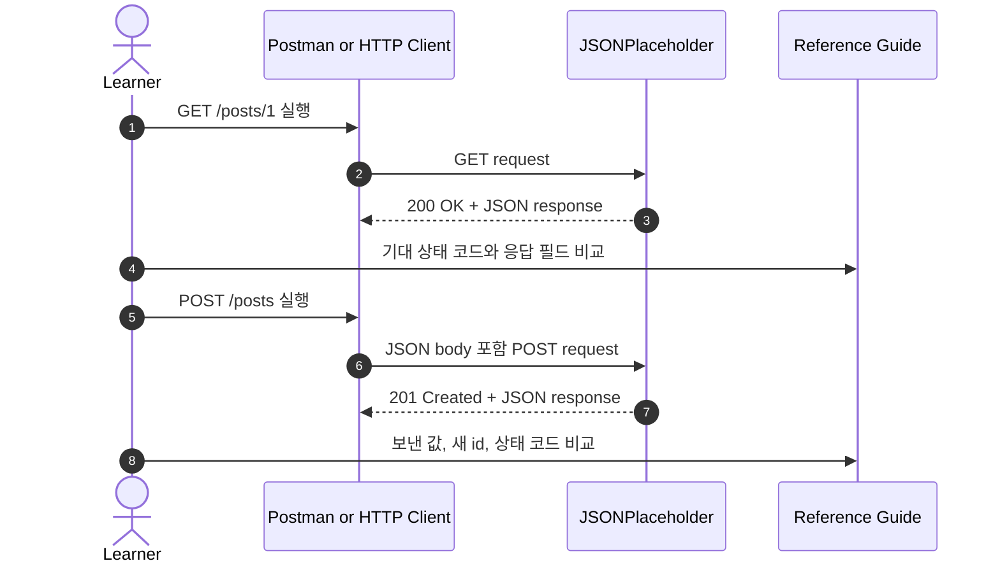
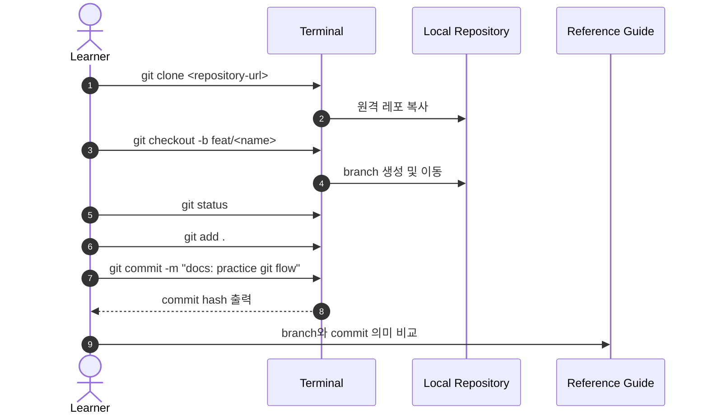
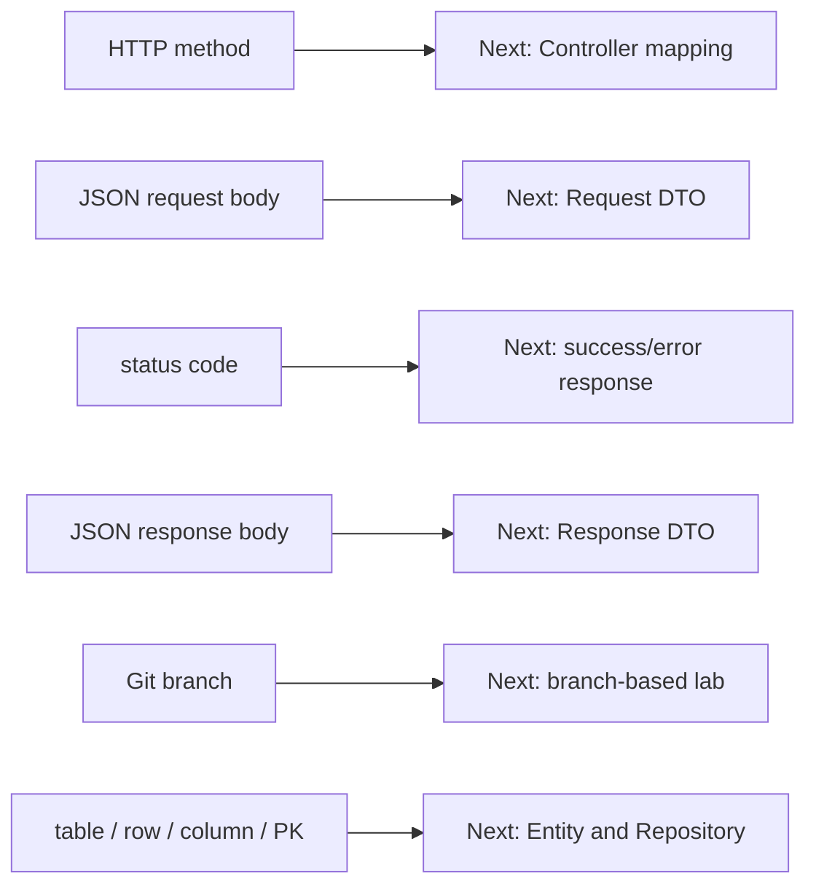

# 이론 정리

> 이 문서는 선수지식 부트캠프의 기준 자료를 바탕으로 HTTP 요청/응답, JSON, Git branch, DB 기본 용어를 설명합니다. 서버 코드를 구현하지 않고, 다음 Spring Boot 실습을 읽기 위한 공통 언어를 맞추는 것이 목표입니다.

## 1. Problem - 왜 선수지식이 필요한가

Spring Boot 실습에서는 요청을 만들고, 응답을 읽고, 브랜치별로 작업하며, 저장 구조를 계속 설명합니다. HTTP 메서드나 상태 코드를 모르면 API가 실패했을 때 원인을 찾기 어렵고, JSON key/value를 구분하지 못하면 요청 DTO와 응답 DTO를 읽기 어렵습니다.

Git branch와 DB 용어도 같은 역할을 합니다. branch는 실습 시작점과 비교 기준을 나누는 장치이고, table, row, column, PK는 저장 계층을 설명하는 기본 언어입니다.

참고 자료의 역할은 실행 결과를 대신하는 것이 아닙니다. 먼저 손으로 요청과 Git 명령을 실행한 뒤, 기대 응답과 용어 설명을 비교하는 기준으로 사용합니다.

## 2. Analyze - 참고 자료를 어떤 기준으로 읽을 것인가

이번 시퀀스는 코드를 작성하지 않으므로 테스트 통과보다 실행 결과를 설명할 수 있는지가 중요합니다.

| 영역 | 기준 자료 | 비교할 질문 |
|---|---|---|
| HTTP GET | `starter/http/get-post.http` | 조회 요청인지, 상태 코드와 body를 함께 읽었는지 확인합니다. |
| HTTP POST | `starter/http/create-post.http` | JSON body를 보내고 `201 Created` 의미를 설명합니다. |
| JSON | `starter/json/create-post-request.json` | key와 value를 구분하고 바꾼 값이 응답에 나타나는지 봅니다. |
| Git | `starter/git/command-flow.txt` | clone, branch, status, add, commit 순서를 설명합니다. |
| DB | `starter/db/members-table-diagram.txt` | table, row, column, PK를 표에서 직접 가리킵니다. |
| 비교 기준 | `docs/checklist.md` | 실행 후 기대 결과와 해석을 확인합니다. |

참고 자료를 먼저 외우기보다 멘티가 실행한 결과를 기준 자료와 나란히 놓고 차이를 읽는 방식이 적합합니다.

## 3. API / 실행 시퀀스 다이어그램

### 3.1 HTTP 요청과 비교 흐름

GET은 조회 요청, POST는 body를 보내 생성 흐름을 연습하는 요청입니다. 응답 body가 보인다는 사실만으로 성공을 판단하지 않고, 상태 코드와 body를 함께 읽습니다.

### 3.2 Git 실행과 비교 흐름

Git 명령은 순서를 외우는 것에서 끝나지 않습니다. 현재 어느 폴더에서 어떤 branch에 있는지, 어떤 변경을 staging했고 어떤 메시지로 기록했는지 설명해야 다음 실습에서 안전하게 작업할 수 있습니다.

## 4. 계층 / DTO / 메시지 흐름

### 4.1 선수지식에서 다음 코드 흐름으로 이어지는 구조

| 현재 개념 | 이번 시퀀스에서 보는 방식 | 다음 시퀀스에서 만나는 방식 |
|---|---|---|
| HTTP method | GET/POST 요청 의도 | Controller의 endpoint method |
| JSON request body | key/value가 있는 요청 데이터 | Request DTO |
| JSON response body | 서버가 돌려주는 결과 데이터 | Response DTO |
| status code | 성공/실패 판단 숫자 | 예외 처리와 응답 상태 |
| Git branch | 작업 흐름 분리 | 시퀀스별 starter와 비교 브랜치 |
| DB table | 데이터를 담는 표 | Entity와 Repository |

### 4.2 JSON과 DTO의 연결

이번 시퀀스에는 Kotlin DTO 코드가 없습니다. 하지만 JSON을 읽는 방식은 다음 시퀀스의 DTO 이해로 바로 이어집니다.

| JSON 예시 | 읽는 방법 | 다음 코드 개념 |
|---|---|---|
| `"title"` | 데이터 이름인 key | DTO field name |
| `"A&I Bootcamp"` | 실제 값인 value | DTO field value |
| request body | 클라이언트가 서버로 보내는 데이터 | Request DTO |
| response body | 서버가 클라이언트로 돌려주는 데이터 | Response DTO |
| `Content-Type: application/json` | body 형식을 알려주는 header | API 요청 처리 조건 |

DTO를 배우기 전에는 JSON의 key와 value를 정확히 읽는 것이 우선입니다. 이 감각이 있어야 Controller에서 어떤 값을 받는지 이해하기 쉽습니다.

## 5. Action - 기준 자료와 비교할 지점

### 5.1 HTTP 응답을 비교합니다

GET 요청은 `200 OK`와 기존 게시글 JSON을 확인합니다. POST 요청은 `201 Created`와 보낸 JSON 값이 응답에 포함되는지 확인합니다.

리뷰 질문:

- method와 URL을 함께 설명하나요?
- 상태 코드와 response body를 함께 읽나요?
- POST 요청에서 body와 `Content-Type`을 확인하나요?

### 5.2 JSON request / response를 비교합니다

JSON은 key와 value로 구성됩니다. 기준 자료의 예시에서 `title`, `body`, `userId`를 바꿨을 때 요청 의미가 어떻게 달라지는지 확인합니다.

리뷰 질문:

- key를 바꾼 것과 value를 바꾼 것을 구분하나요?
- 요청 body와 응답 body가 어떤 값으로 연결되는지 말하나요?
- 상태 코드가 실패일 때 body만 보고 성공으로 판단하지 않나요?

### 5.3 Git 흐름을 비교합니다

`git clone`, `git checkout -b`, `git status`, `git add`, `git commit`은 각각 다른 역할을 가집니다. 기준 자료와 비교할 때는 명령 이름보다 작업 흐름을 설명하는지 봅니다.

리뷰 질문:

- 현재 branch를 확인하나요?
- add와 commit의 차이를 설명하나요?
- branch를 만드는 이유를 "작업 분리"로 설명하나요?

### 5.4 DB 용어를 표에서 비교합니다

회원 표 예시에서 table은 표 전체, row는 한 줄, column은 항목, PK는 row를 구분하는 대표 값입니다.

리뷰 질문:

- 표에서 row 하나를 직접 가리키나요?
- `id`, `name`, `email`을 column으로 설명하나요?
- PK를 row 구분 값으로 설명하나요?

## 6. Result - 확인할 결과와 남은 한계

완료 후에는 다음을 설명할 수 있어야 합니다.

- GET과 POST의 목적 차이
- `200 OK`, `201 Created`, `400 Bad Request`, `404 Not Found`의 기본 의미
- JSON key/value와 request/response body의 차이
- Git clone, branch, add, commit의 흐름
- table, row, column, PK를 표 예시로 설명하는 방법
- 다음 시퀀스에서 JSON이 Request DTO와 Response DTO로 이어진다는 점

남는 한계는 분명합니다. 이번 시퀀스는 Spring Boot 서버를 실행하지 않고 자동 테스트도 없습니다. Controller, Service, Repository, Entity 구현은 다음 시퀀스 이후에 다룹니다.

## 7. 실무 포인트

- 요청 실패를 볼 때는 method, URL, header, body, status code를 한 번에 확인합니다.
- JSON은 문법 오류가 작아 보여도 요청 전체를 실패시킬 수 있습니다. 쉼표, 따옴표, 중괄호를 함께 봅니다.
- Git 명령은 현재 디렉터리와 branch에 영향을 받습니다. 명령 전후에 `git status`를 보는 습관이 좋습니다.
- commit 메시지는 미래의 리뷰어가 변경 의도를 이해할 수 있게 작성합니다.
- DB PK는 row를 안정적으로 찾기 위한 값입니다. 화면에 보이는 이름이나 이메일이 항상 PK 역할을 하지는 않습니다.

## 8. 용어 정리

`HTTP Method`
: 요청의 의도를 나타내는 값입니다. 이번 시퀀스에서는 `GET`과 `POST`를 중심으로 봅니다.

`Status Code`
: 서버가 요청을 어떻게 처리했는지 알려주는 숫자입니다.

`Header`
: 요청이나 응답의 부가 정보를 담습니다. JSON 요청에서는 `Content-Type`을 확인합니다.

`JSON`
: key와 value로 데이터를 표현하는 형식입니다.

`Request Body`
: 클라이언트가 서버에 보내는 본문 데이터입니다.

`Response Body`
: 서버가 클라이언트에 돌려주는 본문 데이터입니다.

`DTO`
: 계층 사이에서 데이터를 옮기기 위한 객체입니다. 이번 단계에서는 JSON 구조를 통해 다음 시퀀스의 DTO를 준비합니다.

`Branch`
: Git에서 작업 흐름을 분리하는 기준입니다.

`Staging Area`
: commit에 포함할 변경을 고르는 중간 영역입니다.

`Commit`
: 변경 묶음을 기록하는 단위입니다.

`Table`
: DB에서 데이터를 담는 표입니다.

`Row`
: table의 한 줄 데이터입니다.

`Column`
: table에서 데이터 종류를 나타내는 항목입니다.

`PK`
: row를 겹치지 않게 구분하는 대표 값입니다.

## 9. 다음 구현으로 연결되는 지점

다음 시퀀스에서는 HTTP 요청이 Controller로 들어오고, JSON body가 Request DTO로 읽히며, 처리 결과가 Response DTO로 돌아갑니다. 이번 시퀀스의 기준 자료는 그 흐름을 읽기 위한 준비 자료로 사용합니다.

멘토용 설명 포인트

- 기준 자료를 먼저 외우게 하기보다 멘티의 실행 결과와 나란히 비교합니다.
- 요청 화면에서는 method, URL, status code, body를 각각 가리키게 합니다.
- Git은 명령 이름보다 현재 branch와 변경 묶음 설명을 확인합니다.
- DB 용어는 회원 표에서 row와 column을 직접 짚게 합니다.
- 다음 시퀀스와 연결할 때는 JSON이 Request DTO와 Response DTO로 이어진다는 정도까지만 설명합니다.

