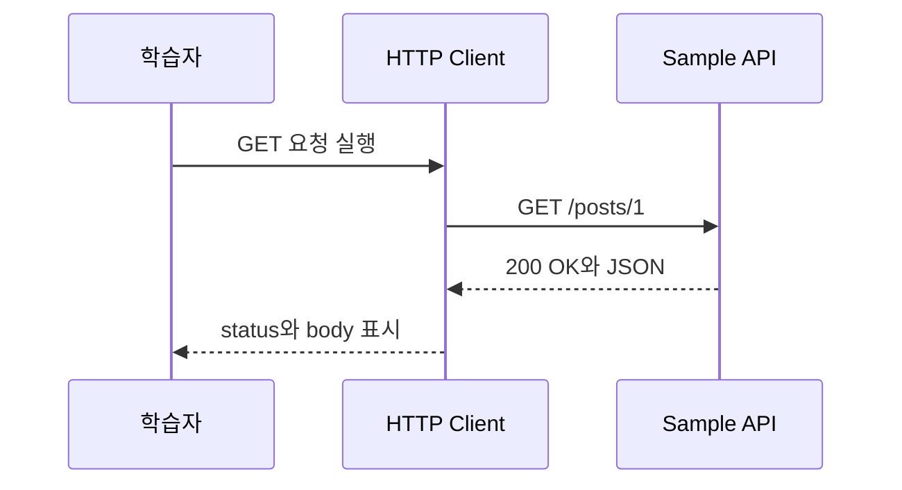

# 선수지식 부트캠프 이론 정리

## 1. 요청을 보냈는데 무엇을 봐야 할까?

백엔드 실습은 요청을 보내고 응답을 읽는 장면이 계속 반복됩니다.
처음부터 Controller 코드를 보기 전에, method, status code, JSON body가 각각 무엇을 알려주는지 먼저 잡아야 합니다.

문제는 응답 body만 보고 성공으로 판단하기 쉽다는 점입니다.
서버는 body와 함께 status code로 처리 결과를 알려주므로, 요청을 볼 때는 method, URL, status code, body를 같이 읽어야 합니다.

## 2. Method와 status는 서로 다른 질문에 답합니다

`GET`은 주로 조회 의도를 나타내고, `POST`는 새 데이터를 보내 생성하는 의도를 나타냅니다.
같은 URL처럼 보여도 method가 다르면 서버가 이해하는 요청 의미가 달라집니다.

상태 코드는 서버가 요청을 어떻게 처리했는지 알려줍니다.
`200 OK`는 조회 성공, `201 Created`는 생성 성공, `400 Bad Request`는 요청 형식 문제, `404 Not Found`는 대상을 찾지 못한 상황으로 읽습니다.

## 3. 작은 요청에서 진단 순서를 먼저 익힙니다

이번 시퀀스는 서버 코드를 만들지 않습니다.
대신 HTTP 요청 파일, JSON body 파일, Git 명령 흐름, DB 표 예시를 직접 열어보고 다음 Spring Boot 실습에서 반복될 기본 장면을 먼저 연습합니다.

```text
요청 보내기 -> 상태 코드 읽기 -> JSON 값 바꾸기 -> Git으로 작업 기록하기 -> 표 구조 설명하기
```

<a id="seq-00"></a>
## 4. Sequence 00: 요청을 보내고 관찰 가능한 결과를 읽기

가장 짧은 진단 경로는 요청 의도를 먼저 고정하고, 서버가 돌려준 status와 body를 함께 읽는 것입니다.
body의 값만 보는 대신 `method + URL -> status -> body` 순서로 확인해야 성공과 실패의 원인을 구분할 수 있습니다.



| 단계 | 들어온 것 | 한 일 | 나간 것 또는 상태 |
| --- | --- | --- | --- |
| 1 | 조회할 리소스 | `GET` method와 URL을 확정 | 실행 가능한 요청 |
| 2 | `GET /posts/1` | Sample API로 전송 | 서버가 요청을 수신 |
| 3 | 서버 처리 결과 | status와 JSON body를 함께 반환 | `200 OK`와 게시글 JSON |
| 4 | 응답 | 조회 성공 여부와 값을 비교 | 다음 요청을 판단할 근거 |

```http
# method와 URL이 조회 의도를 정합니다.
GET https://jsonplaceholder.typicode.com/posts/1
Accept: application/json
```

요청을 실행하면 아직 관찰하지 않은 상태에서 `200 OK`와 JSON을 비교할 수 있는 상태로 바뀝니다.

```jsonc
// key는 유지하고 value를 바꾸면 전송할 게시글 내용이 달라집니다.
{
  "title": "A&I Bootcamp",
  "body": "JSON 값을 수정합니다.",
  "userId": 4
}
```

value를 수정하면 같은 `POST` 경로라도 서버에 전달되는 생성 데이터가 달라집니다.

```bash
# 변경을 선택해 stage에 올린 뒤 현재 branch의 commit으로 기록합니다.
git switch 00-implementation
git add starter/json/create-post-request.json
git commit -m "docs(bootcamp): HTTP 요청 예시 수정"
```

이미 준비된 실습 branch로 이동할 때는 `git switch 00-implementation`을 사용합니다. `git add`는 working tree의 변경 중 선택한 내용을 index에 올리고, `git commit`은 staged changes를 현재 branch가 가리키는 새 commit으로 기록합니다.

DB 표를 읽을 때는 table이 같은 종류의 데이터를 모으고, row가 한 건, column이 한 속성, PK가 row를 구분한다고 연결합니다.
이 네 용어를 요청 JSON과 대응해 두면 다음 시퀀스에서 DTO와 Entity가 어떤 상태를 옮기는지 추적할 수 있습니다.

[Visual Lab에서 입력 조건을 보고 경로 예측하기](./visual-lab/sequences/00/)

## 5. 도구와 응답에서 무엇을 확인할까?

자동 테스트 대신 아래 명령과 손동작을 확인합니다.

```bash
java -version
git --version
```

Postman이나 HTTP 요청 도구에서는 `GET`, `POST`, status code, JSON body를 확인합니다.
Git에서는 새 branch를 만들고, 변경을 add 한 뒤 commit으로 기록합니다.

## 6. 아직 서버 안쪽은 보이지 않습니다

이번 단계는 서버 내부 코드를 만들지 않습니다.
그래서 요청이 실제 Controller로 들어가는 과정은 다음 `spring-boot-rest-crud-lab`에서 확인합니다.

이번 레포의 완료 기준은 “정답을 외우는 것”이 아니라, 요청과 응답을 읽고 Git 작업을 기록할 수 있는 준비 상태를 만드는 것입니다.
